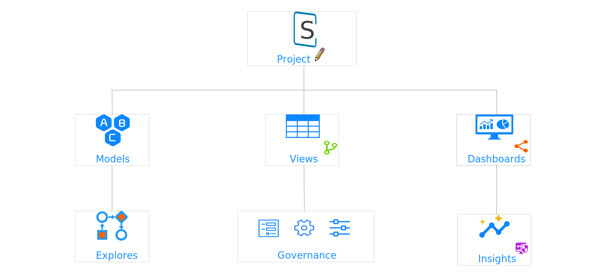

    

# Spotrix

`explore insights for everyone.`

Home page click [here](https://spotrix.github.io/spotrix-web/).

 

## Overview of Spotrix

Powered by [Guinsoo Lab](https://guinsoolab.github.io/glab).

 

## Main Functions

### Morden BI & Analytics
Serve up real-time dashboards for more in-depth, consistent analysis. Access to trustworthy data enables teams to collect fresh results for more precise reporting.

### Integrated Insights
Enhance the tools you're already using by infusing new, relevant data. Unify and empower your teams to make more efficient, data-informed decisions.

### Data-Driver Workflows
Invigorate your workflows with fresh, reliable data. Spotrix gives teams unified access to the answers thy need to driver successful outcomes.

### Custom Applications
Create custom apps that deliver data experiences as unique as your business. Spotrix's embedded analytics solutions, from retail to healthcare, give your customers tha data they need to get the job done.

